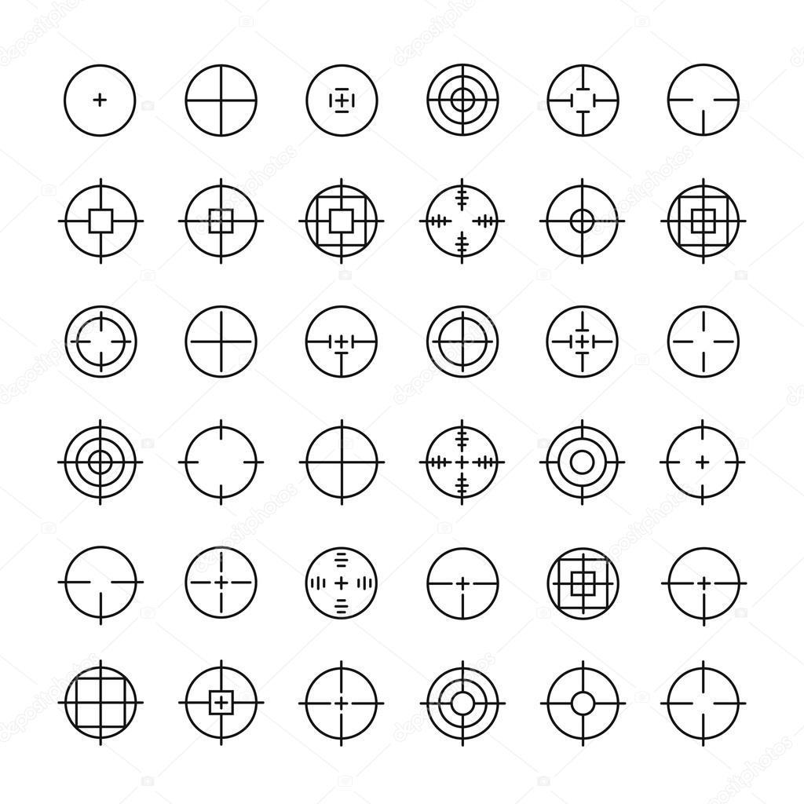
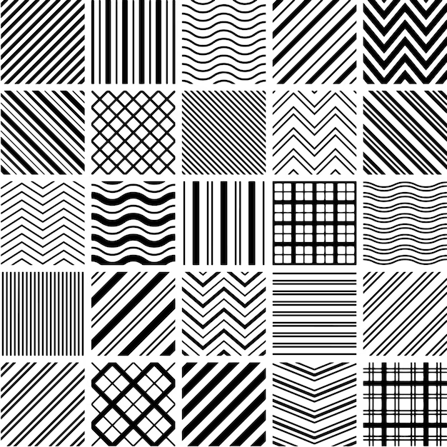

### 高级数学编程(中韩合作) 고급수리프로그램 
### Advanced Mathematical Programming - Physics Library with Processing

물리 엔진(Physics Engine)은 중력, 충돌, 마찰, 강체/연체 운동 등 현실의 물리 법칙을 가상 공간에 구현하는 소프트웨어입니다. 뉴턴 역학을 기반으로 물체 간 상호작용과 운동 상태를 실시간으로 계산하여 시각화합니다.

본 교과목은 Processing을 활용해 물리 엔진의 원리를 이해하고 직접 구현하는 실습 중심 수업입니다. 입자 시스템, 충돌 감지, 힘과 운동량 시뮬레이션 등을 단계적으로 학습하며, 이를 디지털 작품 제작에 응용하는 역량을 기릅니다.

### 교육 목표
- 물리 엔진의 핵심 개념(중력, 충돌, 마찰, 운동량 등)을 이해하고, 뉴턴 역학 기반의 시뮬레이션 원리를 설명할 수 있다.
- Processing 프로그래밍을 활용하여 입자 시스템, 충돌 감지, 강체/연체 운동 등 물리 기반 시뮬레이션을 직접 구현할 수 있다.
- 물리 엔진 프로그래밍 기술을 응용하여 게임, 인터랙티브 미디어, 디지털 시각화 등 창의적인 작품을 기획하고 제작할 수 있다.

### Text
- [http://box2d.org/](http://box2d.org/)
- The Nature of Code: Simulating Natural Systems with Processing, Daniel Shiffman. Dec 2012, The Nature of Code
- Processing: A Programming Handbook for Visual Designers and Artists, Casey Reas and Ben Fry (Foreword by John Maeda). August 2007, MIT Press.
- Processing: Creative Coding and Computational Art (Foundation), Ira Greenberg (Foreword by Keith Peters). May 2007, Friends of Ed.

### Reference Sites
- [OpenProcessing](https://openprocessing.org/), Mycelium, Onecm  
- [https://openprocessing.org/browse?q=game&time=anytime&type=tags&offset=0#](https://openprocessing.org/browse?q=game&time=anytime&type=tags&offset=0#) 
- [Learning Processing](http://learningprocessing.com/), Daniel Shiffman. August 2008, Morgan Kaufmann.

### Processing

2026.05.09  
MovingMark  
[https://openprocessing.org/sketch/877246](https://openprocessing.org/sketch/877246)
[https://processing.org/reference/colorMode_.html](https://processing.org/reference/colorMode_.html)

1 [Pixels](http://learningprocessing.com/examples/chp01/example-01-01-stroke-fill) 
2 [Processing](http://learningprocessing.com/examples/chp02/example-02-01-zoog) 
3 [Interaction](http://learningprocessing.com/examples/chp03/example-03-01-setupdraw) 
4 [Variable](http://learningprocessing.com/examples/chp04/example-04-01-declaringvars)
 
<pre><code>
void setup() void draw()
size(width, height); fullScreen();
colorMode(RGB, 255, 255, 255);  
colorMode(HSB, 360, 100, 100)];
rectMode(CENTER);
noFill(); fill(); 
strokeWeight(weight);
stroke(hue, saturation, brightness);
line(x1, y1, x2, y2);
rect(x, y, width, height);
ellipse(x, y, radius, radius);
arc(x, y, width, height, start, stop);
map(value, start1, stop1, start2, stop2);	
</code></pre>

2026.05.12  

5 [Conditions](http://learningprocessing.com/examples/chp05/example-05-01-conditionals-fadingcolors)
6 [Loop](http://learningprocessing.com/examples/chp06/example-06-01-manylines)
7 [Functions](http://learningprocessing.com/examples/chp07/example-07-01-function-definition)

<pre><code>
background(color); 
random(high); noise(x)
frameCount, frameRate
key, keyCode, keyPressed 
mouseX, mouseY, pmouseX, pmouseY
mouseButton, mousePressed, mouseMoved, mouseDragged, mouseReleased
variable, function
</code></pre>

Simple Logo and Pattern

 

2026.05.19  
### chap 8. Objects

8 [Objects](http://learningprocessing.com/examples/chp08/example-08-01-singleobject)  
MovingCar, RainDrop, MovingMark, ...

[object-oriented programming (OOP)](./OOP.pdf) [pptx](./OOP.pptx) works in Processing  
[https://processing.org/tutorials/objects/](https://processing.org/tutorials/objects/)  
[https://processing.org/reference/class.html](https://processing.org/reference/class.html)  

MovingMark  
[https://openprocessing.org/sketch/877246](https://openprocessing.org/sketch/877246)

Variable
<pre><code>
MovingMark mk1, mk2, mk3;
mk1 = new MovingMark();
mk2 = new MovingMark(100, 300, 120, 50);
mk1.draw();
mk2.draw();
</code></pre>

### chap 9. Arrays

Array
<pre><code>
MovingMark[] mks = new MovingMark[20];
for(int i=0; i&ltmks.length; i++) {
  mks[i] = new MovingMark();
}
for(int i=0; i&ltmks.length; i++) {
  mks[i].draw();
}
</code></pre>

ArrayList
<pre><code>
ArrayList &ltMovingMark&gtmks;
mks= new ArrayList &ltMovingMark&gt();
mks.add(new MovingMark());
for(i=0; i &ltmks.size(); i++) { 
  MovingMark mk = mks.get(i);
  mk.draw();
}  
void mousePressed() {
  mks.add(new MovingMark(mouseX, mouseY, random(360), random(50,100)));
}
</code></pre>

### chap 13. Mathematics
flowers mountains faces tree  
[https://processing.org/examples/tree.html](https://processing.org/examples/tree.html)  
[https://www.openprocessing.org/curation/19/](https://www.openprocessing.org/curation/19/)  
[https://openprocessing.org/sketch/90192](https://openprocessing.org/sketch/90192)   
[https://natureofcode.com/book/chapter-8-fractals/](https://natureofcode.com/book/chapter-8-fractals/)  

[https://www.renderforest.com/music-visualizer.html](https://www.renderforest.com/music-visualizer.html)  
[http://www.rayban.vision/#projects/beat-detection](http://www.rayban.vision/#projects/beat-detection)  

ParticleSystemSmoke  
[https://processing.org/examples/smokeparticlesystem.html](https://processing.org/examples/smokeparticlesystem.html)  

RainDrop Behavior  
[http://learningprocessing.com/examples/chp10/](http://learningprocessing.com/examples/chp10/) example-10-06-raindrop-behavior  

### chap 14. Transformations and 3D 
[transformation](./Transformation.pdf) [pptx](./Transformtion.pptx)  
[https://processing.org/tutorials/p3d/](https://processing.org/tutorials/p3d/) 
<pre><code>
void setup() {
  size(600, 600, P3D);
}
void draw() {
  background(32);
  translate(width/2, height/2);
  rotateX(tx);
  rotateY(ty);
  box(100);
}
void mouseDragged() {
  tx += (pmouseY - mouseY)*0.01;  
  ty += (mouseX - pmouseX)*0.01;  
}
</code></pre>

The Nature of Code : Simulating Natural Systems with Processing(pdf)  
[https://github.com/shiffman/Box2D-for-Processing](https://github.com/shiffman/Box2D-for-Processing) 

### chap 1. Vectors
[https://natureofcode.com/vectors/](https://natureofcode.com/vectors/)

### chap 2. Forces
[https://natureofcode.com/forces/](https://natureofcode.com/forces/)

### chap 3. Oscillation
[https://natureofcode.com/oscillation/](https://natureofcode.com/oscillation/) 

### chap 4. Particles
[https://natureofcode.com/particles/](https://natureofcode.com/particles/) 

### chap 5. Autonomous Agents
[https://natureofcode.com/autonomous-agents/](https://natureofcode.com/autonomous-agents/)

### chap 6. Physics Libraries
[https://natureofcode.com/physics-libraries/](https://natureofcode.com/physics-libraries/) 

### chap 7. Cellular Automata
[https://natureofcode.com/cellular-automata/](https://natureofcode.com/cellular-automata/) 

### chap 8. Fractals
[https://natureofcode.com/fractals/](https://natureofcode.com/fractals/)

### chap 9. Evolutionary Computing
[https://natureofcode.com/genetic-algorithms/](https://natureofcode.com/genetic-algorithms/) 

### chap 10. Neural Networks
[https://natureofcode.com/neural-networks/](https://natureofcode.com/neural-networks/) 

### Box2D 
[http://box2d.org/](http://box2d.org/)  
[http://processingjs.org/](http://processingjs.org/)  
[http://box2d-js.sourceforge.net/](http://box2d-js.sourceforge.net/)  
[http://www.mrdoob.com/projects/chromeexperiments/google-gravity/](http://www.mrdoob.com/projects/chromeexperiments/google-gravity/)  
[http://kowon.dongseo.ac.kr/~lbg/web_lecture/pbox2d/PBox2D.pptx](http://kowon.dongseo.ac.kr/~lbg/web_lecture/pbox2d/PBox2D.pptx)  

[http://www.creativeapplications.net/processing/](http://www.creativeapplications.net/processing/)[kinect-physics-tutorial-for-processing/](kinect-physics-tutorial-for-processing/)  
[https://www.youtube.com/watch?v=W8bukirivpU](https://www.youtube.com/watch?v=W8bukirivpU) CAN Kinect Physics Tutorial  

### LiquidFunProcessing
LiquidFun is based on Erin Catto's Box2D library, which provides 2D, rigid-body simulation in games. LiquidFun extends Box2D to provide particle physics and fluid dynamics.  
[https://github.com/diwi/LiquidFunProcessing](https://github.com/diwi/LiquidFunProcessing)  
[https://google.github.io/liquidfun/Programmers-Guide/html/index.html](https://google.github.io/liquidfun/Programmers-Guide/html/index.html)  

### PixelFlow 
A Processing/Java library for high performance GPU-Computing (GLSL). Fluid Simulation + SoftBody Dynamics + Optical Flow + Rendering + Image Processing + Particle Systems + Physics +...  
[https://diwi.github.io/PixelFlow/](https://diwi.github.io/PixelFlow/)  
[https://vimeo.com/diwi](https://vimeo.com/diwi)   

PixelFlow_Presentation.pptx  
GLSL_Shader_Presentation.pptx  
fluid_simulation_v2.pptx  

[https://www.youtube.com/watch?v=rSKMYc1CQHE](https://www.youtube.com/watch?v=rSKMYc1CQHE)  
[https://www.youtube.com/watch?v=kOkfC5fLfgE](https://www.youtube.com/watch?v=kOkfC5fLfgE)  

Zach Kobrinsky  
[https://zachariahkobrinsky.com/nature-of-code/](https://zachariahkobrinsky.com/nature-of-code/)  
[https://gltf-viewer.donmccurdy.com/](https://gltf-viewer.donmccurdy.com/)  
[https://github.khronos.org/glTF-Sample-Viewer-Release/](https://github.khronos.org/glTF-Sample-Viewer-Release/)  
[https://openprocessing.org/sketch/2833263](https://openprocessing.org/sketch/2833263) p5 shapekey animal by mathfoxLab   
[https://openprocessing.org/sketch/2211319](https://openprocessing.org/sketch/2211319) Genuary 2024 - Day 15 - Physics Library   
[https://openprocessing.org/sketch/2144603](https://openprocessing.org/sketch/2144603) The Crowded Paradise   
[https://openprocessing.org/sketch/2120361](https://openprocessing.org/sketch/2120361) Stacks of Joy 1   
[https://openprocessing.org/sketch/179401/](https://openprocessing.org/sketch/179401/) Blue Mountains by Bárbara Almeida  
[https://openprocessing.org/sketch/1203902](https://openprocessing.org/sketch/1203902) Stone Space2 by Shozo KUZE   
[https://openprocessing.org/sketch/2881122](https://openprocessing.org/sketch/2881122) Bauklötze "Construction" by epibyte  
[https://openprocessing.org/sketch/2861026](https://openprocessing.org/sketch/2861026) Islands by Naoki Tsutae  
[https://openprocessing.org/sketch/2838363](https://openprocessing.org/sketch/2838363) Fluvia by eanutt1272.v2  
[https://openprocessing.org/sketch/2878607](https://openprocessing.org/sketch/2878607) p5.webgpu.js claw by Alwayscodingsomething  
[https://openprocessing.org/sketch/2837844](https://openprocessing.org/sketch/2837844) genuary genuary2026 genuary5 by KaitoFMS  
[https://openprocessing.org/sketch/2878574](https://openprocessing.org/sketch/2878574) Procedural Construct by Kazoops  
[https://openprocessing.org/sketch/1632092](https://openprocessing.org/sketch/1632092) Kandinsky's Circles  by Metamere  
[https://openprocessing.org/sketch/2654309](https://openprocessing.org/sketch/2654309) v6 Puppet by Rajeev Raizada  
[https://openprocessing.org/sketch/2537651](https://openprocessing.org/sketch/2537651) FaceMesh test by Rajeev Raizada  
[https://openprocessing.org/sketch/2066195](https://openprocessing.org/sketch/2066195) MediaPipe-FaceMetrics-2025  
[https://openprocessing.org/sketch/2469730](https://openprocessing.org/sketch/2469730) Hand Tracking Mediapipe  
[https://openprocessing.org/sketch/2902965](https://openprocessing.org/sketch/2902965) mediaPipeMoshMirror   
[https://openprocessing.org/sketch/1587637](https://openprocessing.org/sketch/1587637) Music Visualization  
[https://openprocessing.org/sketch/2926140](https://openprocessing.org/sketch/2926140) light dot jump jump  
[https://openprocessing.org/sketch/2577921](https://openprocessing.org/sketch/2577921) Eisenstein Music Visualizer  
[https://www.youtube.com/watch?v=BVhnmm1SvF0](https://www.youtube.com/watch?v=BVhnmm1SvF0) Audio Visualization and Beat Detection in Unity  

python -m http.server 8000  
[http://localhost:8000/](http://localhost:8000/)  

